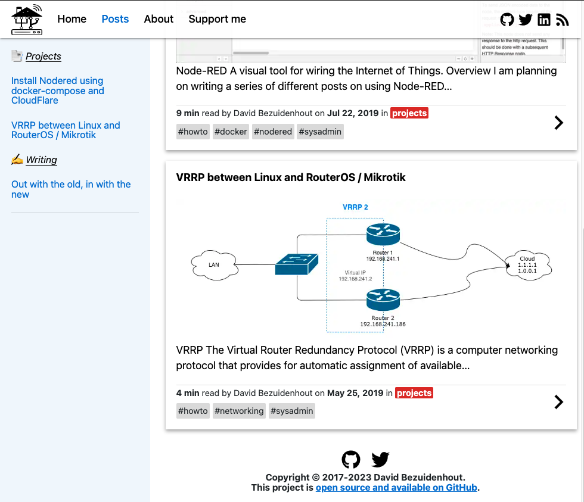

# blog.linuxgeek.za.net

![Project Maintenance][maintenance-shield]
[![GitHub Actions Status][actions-shield]][actions]

### 📘 Blog built with Gatsby and hosted on Github Pages.

This blog uses Gatsby as a React based static site generator. I write articles about Linux sysadmin, networking web dev, life-long learning and other topics from my personal experience.

To get started clone the repo and install the dependencies:

```sh
$ git clone https://github.com/tinuva/blog.linuxgeek.za.net.git blog
$ cd blog
$ npm install
```

To run locally in dev mode:

`$ npm run dev`



## Social Links

- [www.linugeek.za.net](https://www.linugeek.za.net)
- [blog.linugeek.za.net](https://blog.linugeek.za.net)
- [Twitter](https://www.twitter.com/tinuva/)
- [LinkedIn](https://www.linkedin.com/in/davidbez/)


[maintenance-shield]: https://img.shields.io/maintenance/yes/2023.svg
[actions-shield]: https://github.com/tinuva/blog.linuxgeek.za.net/workflows/Gatsby%20Publish/badge.svg
[actions]: https://github.com/tinuva/blog.linuxgeek.za.net/actions