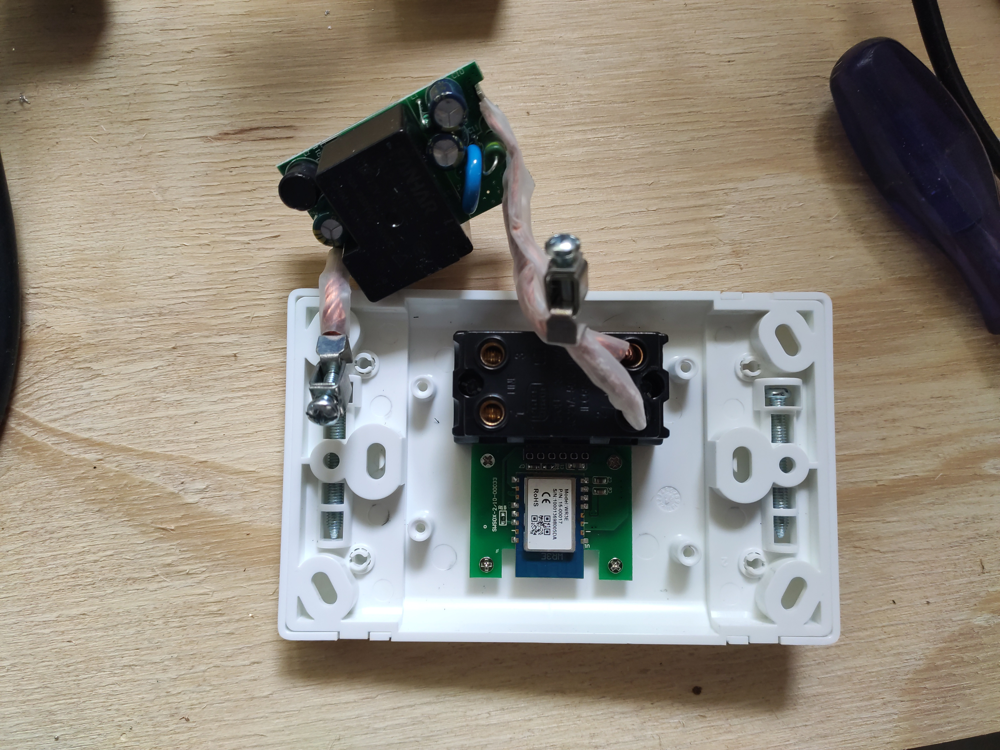
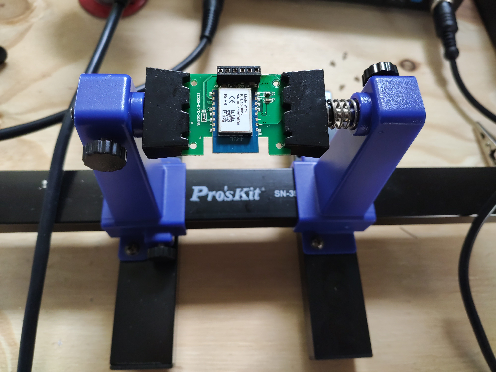
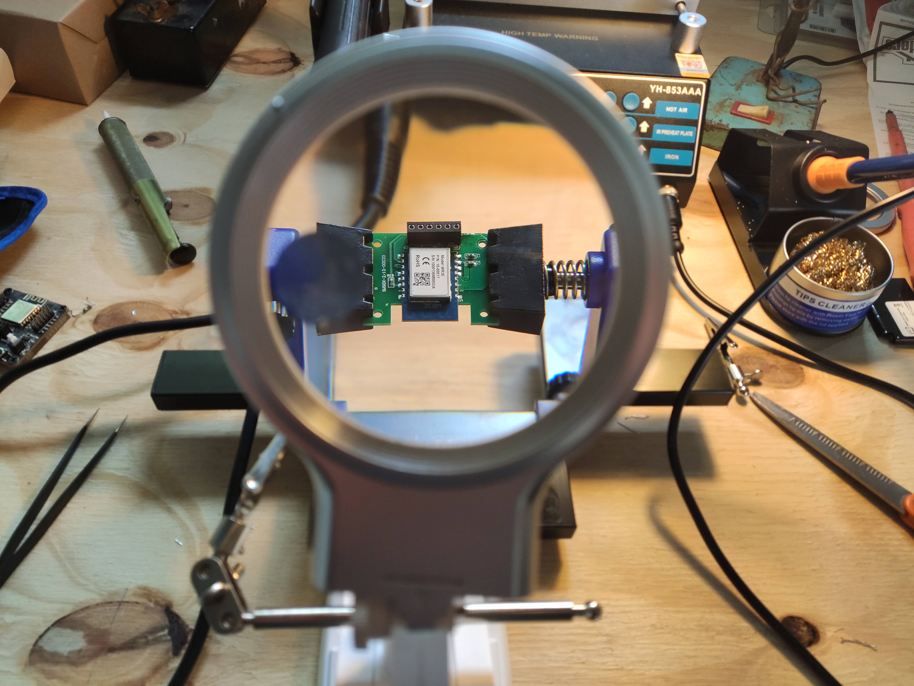
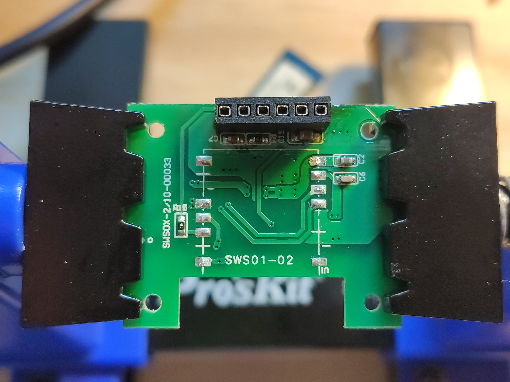
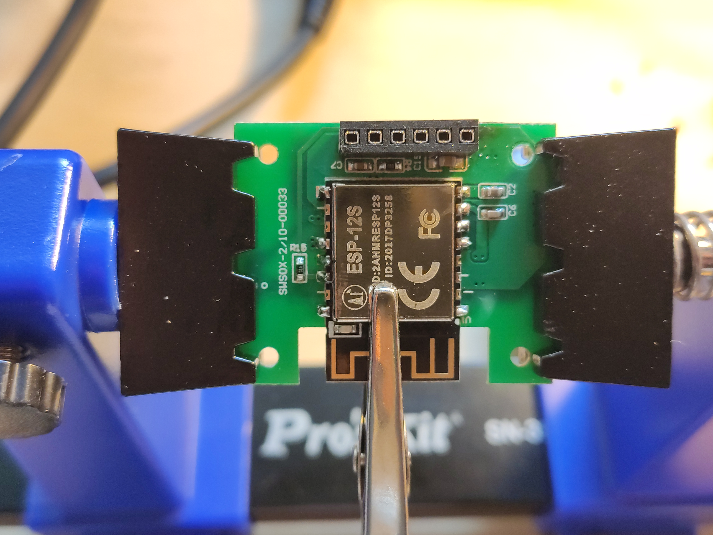

Some on their smart home journey, may have arrived at the time where they want to manage high loads remotely, such as a geyser. Typically, at least in South Africa, geysers come standard with a 3kW element which uses 13 amps. However in my own home, the geyser for the main bedroom was equipped with a 4kW element, which meant a whopping 18 amps! Most smart switches are rated 16 amp for the power metering switches or 10 amp for the non-metering options.

[CBI-electric (Circuit Breaker Industries)][1] released a a few "smart" switches that can handle 30 amp. The one I have here is the [CBI Astute Smart Isolator][2] or ASI for short.

These are all built into the Tuya Smart IoT framework, which I am not a fan off. I prefer where possible using open-source software, including on the IoT devices in my house. In this guide, I will go over the process of converting one to just that!

Let's start.

### 🔩 Components

You will need the following components:

* [CBI Astute Smart Isolator][2]
* ESP-12S module from [RS-Components][3] or [Banggood][4]
* [ESP8266 development board][5] or any usb to serial adapter, such as the popular [CH340G USB-Serial Converter][6]

You can use the ESP-12F as well, but then you will require 2x 10k resistor in addition to the ESP-12F. The recommendation is a 10k 0805 SMD resistor and a 10k 1/4w leaded resistor.

### 🔩 Flashing Tasmota to the ESP-12S

First up, let's program our new controller. I am using my [ESP8266 development board][5] here. This makes the process convenient and easy.


Using the [esptool][6] from Github, this is the command I used after downloading the Tasmota firmware binary.

```bash
esptool.py --port /dev/cu.usbserial-A9UD533R write_flash 0x00000 Downloads/tasmota.bin
```

### Taking the CBI ASI apart

Brand new ASI removed from packaging:


First cover removed and we can see the 30A relay:


Further removal will reveal the WR3E micro controller: 



### Desoldering

I start by putting the board into something to hold it well in place while I work with heat.



My eye sight is also not what it used to be for something up close so I need some help.



Once the WR3E is removed, this is what it looks like.



I then again have some help to keep the ESP-12S in place while I add solder back on.



### Testing

Initial quick testing, only to make sure it turns on and look happy.


Aaand time to put everything back together.


### Configuration

I used the following template to configure the device for Tasmota:

```
{"NAME":"CBI Astute","GPIO":[131,56,0,0,0,21,0,0,134,17,132,0,0],"FLAG":0,"BASE":6}
```

### Calibration

The power metering also needs to be calibrated. The Tasmota documentation cover [power monitoring calibration][8] in detail, however I found that using a [greasemonkey script][9] in Tampermonkey to really fine tune this perfectly and basically, automates the calibration process apart from a few stemps, which I will quickly outline.

1. Install tamper monkey in Chrome.
2. Install the [greasemonkey script][9] in Tampermonkey
3. Modify this script to whatever you will use. For example my bulb is rated 70w at 240v. So I had to put this into the script. The calibration is done based on this and the readings it get, real time. 
4. Have a way to read your current voltage from your power provider as accurate as possible. I read it from my solar inverter.
5. Run these commands on the tasmota device in the console 
   ```
   VoltageSet 233.3
   PowerSet 70.0
   Backlog VoltRes 3; WattRes 3; CurrentSet 300.171526586620926
   ```
ps. VoltageSet is the voltage you read from your meter. So sometimes I
type in 235.2 or 237.8 depending on whatever eskom is pushing into the
house or if you on solar what the inverter is pushing into your house.
The other commands are also in the script telling you what to do.
pps. You need to work out the CurrentSet according to whatever you are
using. There is a formula in the script.

6. I then click on the calibrate button and wait for it to do it's thing. Usually done within less than 2-3 minutes.

Have fun and enjoy automating!

[0]: Linkslist
[1]: https://cbi-lowvoltage.co.za/
[2]: https://cbi-lowvoltage.co.za/asi
[3]: https://za.rs-online.com/web/p/wi-fi-modules/1697593
[4]: https://www.banggood.com/5pcs-ESP8266-ESP-12S-Serial-WIFI-Wireless-Module-Transceiver-ESP8266-4M-Flash-p-1493538.html?p=DX050122090268201806&custlinkid=2697172
[5]: https://www.banggood.com/ESP8266-Test-Board-Burner-Development-Board-WIFI-Module-For-ESP-01-ESP-01S-ESP-12E-ESP-12F-ESP-12S-ESP-18T-p-1684992.htmlp=DX050122090268201806&custlinkid=2697172
[6]: https://www.robotics.org.za/index.php?route=product/product&product_id=2499
[7]: https://github.com/espressif/esptool
[8]: https://tasmota.github.io/docs/Power-Monitoring-Calibration/
[9]: https://github.com/arendst/Tasmota/issues/5484


[x]: https://mybroadband.co.za/forum/threads/cbi-astute-power-monitor-switch-tasmotized.1108106/
