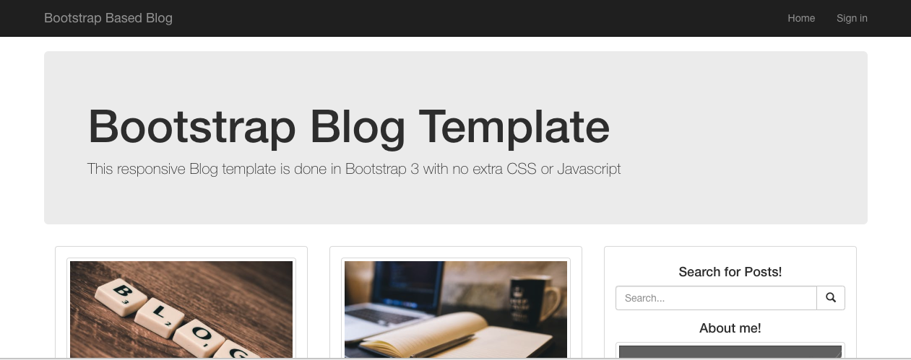

### History

Originally [LinuxGeek.za.net](https://www.linuxgeek.za.net) started out as a Wordpress blog. Back then I was working as a syadmin, long before the cloud hosting space boomed and well I didn't know any better.

### New blog

Fast forward to today, the old blog has long been down and I wanted something back up, that is much easier to manage but most importantly, as low as possible cost in both maintenance time and running cost. This means, no servers and falls in line with the current trend of serverless or static. I played a little around with a blog using AWS Lambda, but it still needed a lot of work and polish, so settled for a static content generator, based on [GatsbyJS](https://www.gatsbyjs.org/).

### The future

In a future post, I will write about and how to get it up and running as I have it here now. Also in due time, I will add back some of the old content, that is still valid today.

Until next time...